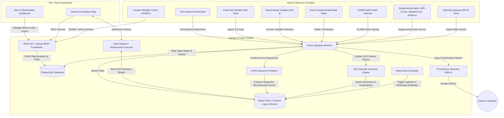

# 🛰️ SkyWatch Live™
### Enterprise-Grade Airspace Surveillance, Space Situational Awareness & Temporal-Spatial Anomaly Detection Platform

<div align="center">

[](https://opensource.org/licenses/MIT)
[](https://react.dev)
[](https://djangoproject.com)
[](https://docs.celeryq.dev)
[](https://prometheus.io)

[⚡ Quick Start](#-quick-start) • [🏗️ System Architecture](#%EF%B8%8F-system-architecture) • [🔧 Configuration](#%EF%B8%8F-runtime-configuration-matrix) • [🚀 Deployments](#-production-deployment-runbook) • [🛡️ Security](#-security--integrity-checklist) • [📊 Observability](#-observability--telemetry-metrics)

</div>

---

## 🖥️ Platform Mission & Operational Intent

**SkyWatch Live™** is a high-performance tactical intelligence platform designed for civil and military airspace surveillance, orbital tracking, and aviation risk mitigation. By combining telemetry ingestion with spatial-temporal predictive machine learning models, SkyWatch Live™ parses high-density global ADS-B state vectors, propagates satellite footprints via orbital mechanics equations, overlays real-time FAA flight restrictions, and forecasts trajectory anomalies in real-time.

The platform serves as a critical decision-support interface for air traffic management, security personnel, and aerospace operators, delivering micro-second telemetry validation, automated geofence auditing, and explainable AI anomaly diagnostics.

<div align="center">
  
</div>

---

## 📊 Performance Capabilities & Ingestion Metrics

Tested telemetry ingestion and processing benchmarks under continuous operational loads:

| Operational Parameter | Capacity Baseline | Functional Description & System Impact |
| :--- | :--- | :--- |
| **Monitored Airframes** | **11,862 Active Vectors** (10,894 Airborne) | Real-time ingest and rendering of high-density global ADS-B state-vectors on 30-second polling cycles. |
| **Geographic Facility Index** | **85,390 Mapped Facilities** (249 Countries) | Dynamic origin, destination, and distance vector mapping resolved on airframe selection. |
| **Predictive Anomaly Scans** | **45 Path Anomalies** (0.38% detection rate) | Asynchronous trajectory evaluation for altitude drift, signal dropouts, and lateral tracking drifts via Celery. |
| **Satellite Tracking** | **Active Orbital Propagation** | Automated processing of CelesTrak TLE formats using SGP4 mechanics to overlay footprints. |
| **Telemetry Granularity** | **Sub-second precision** | Renders pressure altitude (FL), groundspeed, heading, vertical rate, and route execution percentages. |
| **Ingress Filtering** | **Heuristic Confidence Verification** | Automatic filtering of corrupted telemetry vectors before cache and database persistence. |

---

## ✨ Core System Capabilities

### 🛰️ Space Situational Awareness (SSA) & Orbital Mechanics
*   **TLE Ingestion**: Dynamically ingests Two-Line Element (TLE) datasets from CelesTrak for active satellite constellations.
*   **SGP4 Propagation**: Executes real-time analytical orbital coordinate projection and path tracking using SGP4 mathematical models.
*   **Sensor Coverage Swaths**: Computes and overlays sensor footprints and swaths directly onto the tactical map layout.

### 🛡️ Airspace Constraints & Geopolitical Threat Mitigation
*   **Temporary Flight Restrictions (TFR)**: Automatically pulls and caches live FAA airspace restriction datasets, mapping circular hazards and custom exclusion polygons.
*   **Meteorological Hazards (AWC SIGMET)**: Ingests Aviation Weather Center domestic and international SIGMET feeds to visualize weather constraints affecting routing decisions.
*   **Conflict Zone Registries**: Pre-registers 15 high-risk regional airspace boundaries and FIRs (such as UKFV/Dnipro FIR, Rostov/Moscow FIR, OIIX/Tehran FIR, ORBB/Baghdad FIR, OYYE/Sanaa FIR, OSTT/Damascus FIR, HLLL/Tripoli FIR, OAKB/Kabul FIR, ZKKP/Pyongyang FIR, VYYY/Yangon FIR, HSSS/Khartoum FIR, Kashmir Corridor, Taiwan Strait ADIZ, South China Sea disputed sectors, and the Sahel/Niger corridor). *Note: While defined in `conflict-zones.ts`, these boundary definitions are not actively wired up in the default setup, leaving it fully to the user's/operator's choice whether to import, render, or wire them up for active threat alerts.*

### 🧠 Ensemble Anomaly Detection & Trajectory Forecasting
*   **ML Ensemble Classifier**: Runs a 3-model ensemble composed of:
    1.  **Isolation Forest**: Global telemetry outlier scoring.
    2.  **Local Outlier Factor (LOF)**: Density-based local anomaly detection (novelty detection mode).
    3.  **MLP Autoencoder**: Calculates reconstruction error deviations across the 30-dimensional engineered feature space.
*   **Sequence Prediction (LSTM)**: Incorporates an optional sequence autoencoder Long Short-Term Memory (LSTM) network trained using Keras to evaluate sequence dynamics (altitude, velocity, heading rate, vertical rate) over a 30-state temporal horizon.
*   **Explainable AI (XAI)**: Generates structured diagnostics explaining the physical telemetry parameters (e.g., Z-scores, acceleration proxies, envelope violations) that triggered an anomaly flag.

---

## 🏗️ System Architecture

SkyWatch Live™ uses an event-driven, microservice-based architecture to handle high-frequency telemetry streaming, automated machine learning inferences, and asynchronous tasks:



---

## 📁 Repository Layout & File Mapping

```text
skywatch-live/
├── 📁 .github/                  # CI/CD Workflows (GitHub Actions & Dependabot configurations)
├── 📁 backend/                  # Django ASGI Application core
│   ├── 📁 flights/              # Core Flight management app
│   │   ├── 📁 management/       # Django commands (e.g. training LSTM models, db seeders)
│   │   ├── 📁 migrations/       # Database schemas & migrations (observability schema v0006)
│   │   ├── 📁 services/         # Integration Services
│   │   │   ├── 📄 adsb_sources.py        # Deduped supplementary ADS-B feeds (ADS-B One, Lol, Airplanes.live)
│   │   │   ├── 📄 advanced_detection.py   # Proximity alerts, loitering/circling, geofence, and profile deviations
│   │   │   ├── 📄 aircraft_db.py         # Local aircraft database lookup routines utilizing aircraftDatabase.csv
│   │   │   ├── 📄 airspace_restrictions.py # FAA TFR & Aviation Weather Center SIGMET aggregators
│   │   │   ├── 📄 anomaly_detector.py    # Rule Engine + ML Ensemble (Isolation Forest + LOF + MLP Autoencoder)
│   │   │   ├── 📄 cache.py               # Redis-based state caching and serialization helper
│   │   │   ├── 📄 celestrak.py           # Two-Line Element (TLE) parser and SGP4 orbital propagator
│   │   │   ├── 📄 explainability.py      # Explainable AI diagnostic generation for flagged anomalies
│   │   │   ├── 📄 faa_radar.py           # Secondary FAA radar telemetry stub receiver
│   │   │   ├── 📄 flight_profiler.py     # Per-airframe EMA behavioral profiles
│   │   │   ├── 📄 kalman_predictor.py    # Kalman Filtering for telemetry smoothing & coordinate estimation
│   │   │   ├── 📄 ogn_client.py          # Open Glider Network (FLARM) ingestion client
│   │   │   ├── 📄 opensky.py             # OpenSky Network API ingestion client
│   │   │   ├── 📄 prediction.py          # Kinematic state trajectory prediction handler
│   │   │   ├── 📄 satellite_adsb.py      # Space-based ADS-B telemetry stubs
│   │   │   ├── 📄 tfr.py                 # Temporary Flight Restrictions client/cacher
│   │   │   ├── 📄 uat_client.py          # Low-altitude UAT (978 MHz) receiver interface
│   │   │   └── 📄 weather.py             # METAR and SIGMET feeds integration client
│   │   ├── 📄 consumers.py      # WebSockets channel consumer handlers
│   │   ├── 📄 metrics.py        # Prometheus metric exporter (Gauge, Counter, Histogram registries)
│   │   ├── 📄 models.py         # DB Entities (Aircraft, FlightState, FlightRoute, FlightPosition, AlertRule, AnomalyEvent, SystemMetrics, AircraftProfile)
│   │   ├── 📄 tasks.py          # Celery background queue processing routines
│   │   ├── 📄 views.py          # DRF REST Endpoints (TFRs, Flight Tracking, Custom Alerts, Analytics)
│   │   └── ...
│   ├── 📁 ml/                   # Machine Learning Codebase
│   │   ├── 📄 features.py       # 30-Dimensional Feature Engineering pipeline
│   │   ├── 📄 lstm.py           # Keras LSTM Sequence Reconstruction model
│   │   └── 📄 train.py          # Model compilation & fitting script
│   └── 📄 requirements.txt      # Python dependencies list
├── 📁 frontend/                 # React frontend powered by Vite & TanStack Start
│   ├── 📁 public/               # Asset distribution, static resources, and showcases
│   ├── 📁 src/components/       # UI Deck
│   │   ├── 📄 AlertRulesPanel.tsx # Geofencing & threshold rules configuration widget
│   │   ├── 📄 AnalyticsPanel.tsx  # Interactive charts (groundspeed profiles, altitude bands, alert trends)
│   │   ├── 📄 FlightDetailPanel.tsx # Operational parameters, charts, and flight trajectory playback
│   │   ├── 📄 GlobalDashboard.tsx # Core layout containing flight queues, search panels, and quick statistics
│   │   ├── 📄 MapLegend.tsx       # Leaflet Map overlays legend
│   │   └── 📄 MapView.tsx         # Leaflet Canvas overlay, rendering flights, paths, TFR circles, & footprints
│   ├── 📁 src/hooks/            # State and socket connectors (useFlights, useSatellites, useFlightTrack)
│   ├── 📁 src/lib/              # Helper libraries
│   │   ├── 📄 aircraft-class.ts # ICAO classification (e.g. High Performance, Heavy, Rotorcraft, Glider)
│   │   ├── 📄 conflict-zones.ts  # Pre-registered FIR boundary coordinates (UKFV, OIIX, ORBB, OYYE, OSTT)
│   │   └── 📄 prediction.ts     # Client-side trajectory forecasting algorithms
│   ├── 📁 src/routes/           # Main routes & API proxies (TanStack Start server-only routes)
│   └── ...
├── 📁 grafana/                  # Grafana dashboards & Prometheus datasource configs
├── 📁 monitoring/               # Prometheus configuration targets
└── 📄 docker-compose.yml        # Infrastructure stack (Postgres, PgBouncer, Redis, Jaeger, Prometheus, Grafana)
```

---

## 📡 REST API Developer Reference

All core backend endpoints are versioned under `/api/v1/` and expose the following operations:

### ✈️ Flight Telemetry & Trajectories
*   `GET /api/v1/flights/` — Returns list of active airborne airframes within the tracking cache.
*   `GET /api/v1/flights/<icao24>/` — Retrieves detailed state vectors, ownership registries, and physical characteristics of a specific ICAO hex address.
*   `GET /api/v1/flights/<icao24>/route/` — Resolves the sessionized flight trajectory as GeoJSON coordinates for map overlay.
*   `GET /api/v1/playback/` — Fetches historical coordinate segments for flight path replay sessions.
*   `GET /api/v1/predictions/<icao24>/` — Computes predicted coordinates, altitude, and confidence intervals for 1, 2, 3, 5, and 10 minutes ahead.

### 🛡️ Airspace Constraints & Weather
*   `GET /api/v1/airspace/restrictions/` — Aggregates live airspace restrictions (SIGMET meteorological hazard alerts, geopolitical FIR risks).
*   `GET /api/v1/airspace/tfr/` — Pulls active FAA Temporary Flight Restrictions geofences.
*   `GET /api/v1/weather/metar/` — Queries raw and parsed METAR telemetry for target airports.

### 🧠 Tactical Alerts, Anomalies & Configuration
*   `GET /api/v1/anomalies/` — Streams active spatial-temporal anomalies.
*   `GET /api/v1/anomalies/history/` — Queries resolved anomalies.
*   `GET /api/v1/anomalies/<id>/explanation/` — Generates explainable AI JSON diagnostics detailing the anomaly score composition.
*   `POST /api/v1/anomalies/<id>/feedback/` — Submits supervisor approval or rejection comments on model flags to retrain classifiers.
*   `GET /api/v1/alert-rules/` — Retrieves all configured geofences and kinematic threshold alert rules.
*   `POST /api/v1/alert-rules/` — Creates a new custom alert rule.
*   `GET /api/v1/alert-rules/<id>/` — Retrieves detailed specifications for a specific alert rule.
*   `PATCH /api/v1/alert-rules/<id>/` — Partially updates a custom alert rule structure.
*   `DELETE /api/v1/alert-rules/<id>/` — Removes a custom alert rule.

### 📊 Observability & System Analytics
*   `GET /api/v1/analytics/` — Returns dashboard metrics summary (counts, anomaly rates, average ML score, timelines).
*   `GET /api/v1/analytics/timeline/` — Returns historical system metrics over specified hours lookback.
*   `GET /api/v1/analytics/traffic/` — Aggregates hourly active aircraft counts.
*   `GET /api/v1/analytics/routes/` — Lists most active flight routes (origin to destination airports).
*   `GET /api/v1/analytics/anomaly-rate/` — Computes daily metrics showing anomaly occurrences per 100 flights.
*   `GET /api/v1/analytics/aircraft-types/` — Categorizes database distribution of aircraft manufacturer and model types.
*   `GET /api/v1/sources/` — Resolves counts and metadata for active telemetry providers (OpenSky, ADSB-One, FLARM, Satellite, etc.).
*   `GET /api/v1/satellites/` — Retrieves satellite Two-Line Element (TLE) datasets propagated via SGP4 mechanics.

---

## ⚙️ Runtime Configuration Matrix

The application supports two operational deployment profiles:

| Operational Profile | Core Infrastructure | Target Use Case & Operational Impact |
| :--- | :--- | :--- |
| **`frontend-only`** | React Application Only | Feeds are proxied directly using serverless TanStack Start API endpoints. Renders simulated/cached telemetry. Ideal for UI testing, demos, or offline structural reviews. |
| **`full-stack`** | Daphne + Celery + Redis + PostgreSQL | Full operations. Enables background ML scoring, automated route assembly, FAA TFR caching, and live WebSocket telemetry streams. **Required for production surveillance.** |

---

## 🛠️ System Prerequisites

Verify that the local environment matches the following tool standards before deployment:

*   **Node.js** `22.x` or higher (Active LTS) 🟢
*   **npm** `10.x` or higher 📦
*   **Python** `3.11.x` or higher 🐍
*   **Docker Desktop** (Or standalone `PostgreSQL 16+`, `PgBouncer 1.24+`, `Redis 7+`, `Jaeger 1.57+`, `Prometheus`, `Grafana`) 🐳

---

## ⚡ Quick Start

### 🏁 Automated Environment Bootstrap (Windows)

To automatically configure local environment variables, compile required python packages, execute migrations, configure database containers, and run development servers concurrently:

```powershell
npm run startup
npm run dev-all
```

---

### 💻 Manual Cross-Platform Setup (Linux / macOS)

For manual installations or execution on POSIX-compliant operating systems:

#### 1. Launch Infrastructure Containers
Ensure Docker is active, then spin up PostgreSQL, PgBouncer, Redis, Jaeger, Prometheus, and Grafana:
```bash
docker compose up -d
```

#### 2. Configure Backend Server
```bash
cd backend
python -m venv venv
source venv/bin/activate  # On Windows: .\venv\Scripts\activate
pip install -r requirements.txt
cp .env.example .env
python manage.py migrate
python manage.py train_lstm_anomaly  # Initialize ML model weights
cd ..
```

#### 3. Configure Frontend Client
```bash
cd frontend
npm ci
cp .env.example .env.local
cd ..
```

#### 4. Execute Coordinated Process Stack
```bash
npm run dev-all
```

---

### 📍 Local Network Entrypoints

The default local ports and targets are defined as:

*   **Surveillance UI Dashboard**: [http://localhost:5173](http://localhost:5173)
*   **Django REST API Server**: [http://localhost:8000/api/v1/](http://localhost:8000/api/v1/)
*   **Prometheus Metrics Endpoints**: [http://localhost:8000/metrics](http://localhost:8000/metrics)
*   **Prometheus Web Console**: [http://localhost:9090](http://localhost:9090)
*   **Grafana Observability Portal**: [http://localhost:3001](http://localhost:3001) (Credentials: `admin` / `admin`)
*   **Jaeger Distributed Tracing UI**: [http://localhost:16686](http://localhost:16686)
*   **Backend Liveness Probe**: [http://localhost:8000/healthz/](http://localhost:8000/healthz/)
*   **Backend Readiness Probe**: [http://localhost:8000/readyz/](http://localhost:8000/readyz/)
*   **Backend Live State Probe**: [http://localhost:8000/health/live](http://localhost:8000/health/live)
*   **Backend Service Readiness Probe**: [http://localhost:8000/health/ready](http://localhost:8000/health/ready)
*   **Backend Core JSON Stats Probe**: [http://localhost:8000/health/metrics](http://localhost:8000/health/metrics)

---

## 💻 Process Management Commands

High-level shortcuts mapped inside the root package orchestrator:

| Command | Process Type | Purpose |
| :--- | :--- | :--- |
| `npm run dev` | Frontend | Boots React development build server. |
| `npm run backend:dev` | Backend | Boots Django backend web server. |
| `npm run dev-all` | Orchestration | Starts React client and Django servers concurrently. |
| `npm run check` | Frontend | Audits React types, runs ESLint checks, and compiles frontend static bundles. |
| `npm run backend:check` | Backend | Performs internal Django syntax and settings integrity validation. |
| `npm run backend:check-deploy` | Backend | Evaluates settings against production security criteria. |
| `npm run backend:migrate` | Backend | Executes structural SQL migrations on the PostgreSQL database. |
| `npm run backend:celery` | Backend | Starts Celery async tasks processor. |
| `npm run backend:beat` | Backend | Starts Celery Beat periodic task scheduler. |
| `npm run db:reset` | Database | Resets database schemas and executes clean migration setup. |
| `npm run startup` | Setup | Standard automated bootstrap environment wizard (includes docker compose). |
| `npm run startup:nodock` | Setup | Boots in SQLite/in-memory fallback mode bypassing Docker infrastructure. |
| `npm run backend:test` | Quality | Launches backend Django unit test runner. |
| `npm test` | Quality | Executes verification suites across both frontend and backend directories. |
| `npm run docker:up` | Infrastructure | Launches Docker compose container services. |
| `npm run docker:down` | Infrastructure | Stops and removes Docker compose container services. |
| `npm run docker:logs` | Infrastructure | Follows the log stream from running Docker containers. |

---

## 🔧 Environment Configuration

> [!CAUTION]
> **Credential Security**: Never commit `.env`, `.env.local`, API keys, DB credentials, or generated secrets to source control. The repository ignores these by default.

### 🔒 Backend Configuration Parameters (`backend/.env`)

| Variable | Requirement | Description & Default Settings |
| :--- | :--- | :--- |
| `DJANGO_SECRET_KEY` | 🔴 Required | Core cryptographic key for system signatures and sessions. |
| `DJANGO_DEBUG` | 🔴 Required | Boolean flag. Must be set to `False` in staging and production to prevent disclosure of stack traces. |
| `ALLOWED_HOSTS` | 🔴 Required | Comma-separated list of public hostnames or IP addresses. |
| `CSRF_TRUSTED_ORIGINS` | 🔴 Required | Valid target HTTPS origins allowed to bypass cross-site request forgery protection. |
| `CORS_ALLOWED_ORIGINS` | 🔴 Required | Comma-separated list of approved frontend domain origins. |
| `DATABASE_URL` | 🔴 Required | Complete connection string for target PostgreSQL database. |
| `READ_REPLICA_DATABASE_URL` | ⚪ Optional | Target database URL mapping for read replicas. |
| `REDIS_URL` | 🔴 Required | Complete target Redis network endpoint. |
| `OPENSKY_CLIENT_ID` | ⚪ Optional | API client ID to bypass default public request rate limiting. |
| `OPENSKY_CLIENT_SECRET` | ⚪ Optional | API client credential for authenticating with the telemetry feed. |
| `ADSBONE_ENABLED` | ⚪ Optional | Boolean. Enables the ADS-B One ingestion stream. Default: `True`. |
| `AIRPLANESLIVE_ENABLED` | ⚪ Optional | Boolean. Enables the Airplanes.live ingestion stream. Default: `True`. |
| `ADSBLOL_ENABLED` | ⚪ Optional | Boolean. Enables the ADSB.lol ingestion stream. Default: `True`. |
| `OGN_ENABLED` | ⚪ Optional | Boolean. Enables the Open Glider Network (FLARM) ingestion stream. Default: `True`. |
| `FAA_RADAR_ENABLED` | ⚪ Optional | Boolean. Enables the FAA/military radar ingestion stubs. Default: `True`. |
| `UAT_ENABLED` | ⚪ Optional | Boolean. Enables the low-altitude UAT (978 MHz) receiver ingestion. Default: `True`. |
| `SATELLITE_ADSB_ENABLED` | ⚪ Optional | Boolean. Enables oceanic space-based ADS-B stubs. Default: `True`. |
| `CELESTRAK_SATELLITES_ENABLED` | ⚪ Optional | Boolean. Enables the CelesTrak TLE fetching background runner. Default: `True`. |
| `OPENSKY_USERNAME` | ⚪ Optional | Username for OpenSky basic authentication if OAuth is not configured. |
| `OPENSKY_PASSWORD` | ⚪ Optional | Password for OpenSky basic authentication if OAuth is not configured. |
| `ALLOW_IN_MEMORY_CHANNEL_LAYER` | ⚪ Optional | Boolean. Permits falling back to Django's in-memory channel layer if Redis is offline. Default: `False`. |
| `CORS_ALLOW_CREDENTIALS` | ⚪ Optional | Boolean. Enables or disables CORS credentials flag. Default: `True`. |
| `LOG_LEVEL` | ⚪ Optional | Logging severity threshold (DEBUG, INFO, WARNING, ERROR). Default: `INFO`. |
| `SENTRY_DSN` | ⚪ Optional | Target DSN URL to configure Sentry error tracking integration. |
| `DJANGO_ENV` | ⚪ Optional | Environment name tag (e.g. `production`, `development`). |
| `OTEL_EXPORTER_OTLP_ENDPOINT` | ⚪ Optional | OTLP target endpoint for OpenTelemetry metrics/spans export. Default: `http://localhost:4317`. |
| `METRICS_USER` | ⚪ Optional | Basic authentication username to secure the `/metrics` endpoint. |
| `METRICS_PASSWORD` | ⚪ Optional | Basic authentication password to secure the `/metrics` endpoint. |
| `TFR_GEOJSON_URL` | ⚪ Optional | Direct override URL to pull FAA TFR GeoJSON data directly. |
| `CELESTRAK_REQUEST_TIMEOUT_SECONDS` | ⚪ Optional | Timeout in seconds for initial CelesTrak requests. Default: `3`. |
| `CELESTRAK_CATALOG_TIMEOUT_SECONDS` | ⚪ Optional | Timeout in seconds for full satellite catalog requests. Default: `10`. |
| `FLIGHT_ROUTE_LOOKBACK_HOURS` | ⚪ Optional | Time lookback window for mapping historical aircraft flight paths. Default: `12`. |
| `FLIGHT_ROUTE_SESSION_GAP_MINUTES` | ⚪ Optional | Inactivity threshold before splitting flight routes into separate sessions. Default: `90`. |

### 🎨 Frontend Configuration Parameters (`frontend/.env.local`)

| Variable | Requirement | Description & Default Settings |
| :--- | :--- | :--- |
| `VITE_SKYWATCH_API_BASE` | ⚪ Optional | REST endpoint targeting the active backend instance. |
| `VITE_SKYWATCH_WS_URL` | ⚪ Optional | WS protocol endpoint targeting ASGI Channel Layer routing. |
| `OPENSKY_CLIENT_ID` | ⚪ Optional | Ingest client username (restricted to server-side context). |
| `OPENSKY_CLIENT_SECRET`| ⚪ Optional | Ingest client secret (restricted to server-side context; never exposed to browser context). |
| `ALLOWED_AIRCRAFT_IMAGE_HOSTS` | ⚪ Optional | Comma-separated list of permitted image API provider hostnames. Default: `adsbdb.com,photos.adsbdb.com`. |
| `MAX_AIRCRAFT_IMAGE_BYTES` | ⚪ Optional | Maximum accepted byte size limit for fetching/caching images. Default: `5000000`. |

---

## 🧠 Telemetry Analytics & Feature Engineering Detail

To detect complex anomalies, raw flight state telemetry is expanded into a **30-dimensional normalized feature vector** within the `ml/features.py` pipeline. This vector is divided into six distinct feature groups:

1.  **Kinematic Features**:
    *   `velocity_ms`: Ground speed in meters/second.
    *   `baro_altitude_m`: Barometric altitude in meters.
    *   `vertical_rate_ms`: Vertical rate of climb/descent.
    *   `heading_sin`/`heading_cos`: Sine and cosine of true track.
    *   `ground_speed_ratio`: Current speed relative to maximum speed capability of the aircraft's ICAO category.
    *   `mach_estimate`: Estimated Mach number using ISA temperature lapse equations.
    *   `altitude_rate_of_change`: Direct vertical rate.
2.  **Temporal Derivative Features**:
    *   `acceleration_proxy`: Absolute vertical rate relative to ground speed.
    *   `altitude_jerk`: Absolute vertical rate relative to altitude.
    *   `heading_rate`: Rate of turn (calculated from heading history).
    *   `signal_freshness_decay`: Time-decay indicator since last signal reception.
    *   `position_staleness`: Latency between position time and signal time.
    *   `contact_gap_ratio`: Ratio of lost communication to time.
3.  **Aircraft-Type-Normalized Features**:
    *   `velocity_z_for_category`: Z-score of velocity against the EMA category baseline.
    *   `altitude_z_for_category`: Z-score of altitude against the EMA category baseline.
    *   `vertical_rate_z_for_category`: Z-score of vertical rate.
    *   `speed_envelope_violation`: Margin by which the flight exceeds category speed limits.
4.  **Geospatial Features**:
    *   `latitude_band`: Normalization from polar (-1) to equatorial (1).
    *   `longitude_band`: Normalized longitudinal position.
    *   `heading_consistency`: Tracking stability indicator.
    *   `ground_track_curvature`: Trajectory curvature factor.
5.  **Interaction Features**:
    *   `altitude_velocity_product`: Scalar product of altitude and speed.
    *   `vertical_energy_rate`: Product of climb rate and ground speed.
    *   `kinetic_energy_proxy`: Kinetic energy indicator ($E_k \propto v^2$).
    *   `drag_coefficient_proxy`: Aerodynamic drag estimation proxy.
6.  **Phase-Aware Features**:
    *   `estimated_flight_phase`: Categorization (Ground, Takeoff, Climb, Cruise, Descent, Approach).
    *   `phase_altitude_deviation`: Altitude deviation relative to typical phase baseline.
    *   `phase_speed_deviation`: Speed deviation relative to typical phase baseline.
    *   `altitude_speed_ratio`: Instantaneous ratio of flight altitude to velocity.

---

## 📊 Observability & Telemetry Metrics

SkyWatch Live™ exposes a `/metrics` endpoint instrumented for Prometheus scraping. Key exported operational metrics include:

| Metric Name | Type | Description |
| :--- | :--- | :--- |
| `skywatch_active_flights_total` | **Gauge** | Count of active flight vectors in the cache memory. |
| `skywatch_anomalies_detected_total` | **Counter** | Cumulative anomalies detected (labeled by `severity`: `low`, `medium`, `high`, `critical`). |
| `skywatch_websocket_connections` | **Gauge** | Count of concurrent client connections to the ASGI Daphne server. |
| `skywatch_data_ingestion_latency_seconds` | **Histogram** | Time taken (seconds) to ingest, parse, and commit state vectors. |
| `skywatch_cache_hits_total` / `_misses_total` | **Counter** | System cache transaction performance flags. |
| `skywatch_celery_task_duration_seconds` | **Histogram** | Execution duration of background tasks (labeled by `task_name`). |

---

## 🚀 Production Deployment Runbook

For high-availability, continuous airspace surveillance, organize your stack using process isolation:

### ⚙️ Recommended Topography

1.  **Static Distribution Layer**: Pre-build your React codebase using `npm run build` in `/frontend`, then serve static assets via high-performance web servers (e.g. Nginx or Cloudflare Edge).
2.  **Asynchronous Web Servers**: Daphne or Uvicorn servers should handle dynamic REST API and WebSocket processes within the ASGI layer:
    ```bash
    daphne -b 0.0.0.0 -p 8000 skywatch.asgi:application
    ```
3.  **Asynchronous Task Queue**: Deploy Celery workers to process flight predictions, SGP4 orbit computations, and ingestion streams:
    ```bash
    celery -A skywatch worker --loglevel=INFO -Q default,high_priority
    ```
4.  **Time-based Task Scheduler**: Launch Celery Beat to trigger routine database cleaning and polling:
    ```bash
    celery -A skywatch beat --loglevel=INFO
    ```
5.  **Observability Exporters**: Monitor target system health metrics using the built-in Prometheus and Grafana structures.

---

### 🛡️ Pre-Release Audit Script

Run this verification chain inside your CI/CD runner prior to deploying any production branch:

```bash
# 1. Run complete testing suites and typescript checks
npm test

# 2. Run Django production configuration audits
cd backend
python manage.py check --deploy
python manage.py makemigrations --check --dry-run
python manage.py migrate --check
python manage.py collectstatic --noinput --clear
```

---

## 🛡️ Security & Integrity Checklist

- [ ] Verify `DJANGO_DEBUG` is disabled (`False`) in the production environment.
- [ ] Enforce HTTPS-only routing and configure HSTS policies on Nginx/LB level.
- [ ] Restrict database incoming traffic to encrypted connections only (`sslmode=require`).
- [ ] Enforce CORS strict configurations (`CORS_ALLOWED_ORIGINS` mapped exactly to frontend).
- [ ] Set up automated container checks and cluster health queries referencing `/healthz/` and `/readyz/` endpoints.

---

## 🔍 Troubleshooting

<details>
<summary><b>❌ Connection Failure: DJANGO_SECRET_KEY is required</b></summary>
<br>

This indicates that Django cannot find a valid secret key. Copy the `backend/.env.example` template to `backend/.env`, populate `DJANGO_SECRET_KEY` with a strong random string, or execute the rapid bootstrap command:
```powershell
npm run startup
```
</details>

<details>
<summary><b>❌ Connection Failure: ALLOWED_HOSTS must be set</b></summary>
<br>

When `DJANGO_DEBUG=False`, Django requires explicit host verification to protect against host header injections. Ensure `ALLOWED_HOSTS` in your `backend/.env` lists the public IP or DNS address of your backend web server.
</details>

<details>
<summary><b>❌ Connection Failure: WebSockets or Celery fails with Redis errors</b></summary>
<br>

SkyWatch Channels and queue structures rely heavily on Redis. Ensure your Redis container is running:
```bash
docker compose up -d redis
```
If you are running Redis on a non-standard port or external cloud server, double-check your connection string in `REDIS_URL`.
</details>

<details>
<summary><b>❌ Network Failure: Frontend cannot access Backend REST endpoints</b></summary>
<br>

Confirm that `VITE_SKYWATCH_API_BASE` is pointing to the correct port (usually `http://localhost:8000` when running Django locally) and verify that the backend's `CORS_ALLOWED_ORIGINS` matches the frontend's address exactly.
</details>

---

## ⚠️ System Operational Limitations

Operators and developers should note the following core operational and hardware constraints within the platform:

1. **Redis Scalability Fallback**: When Redis is offline, the system degrades to a non-distributed `InMemoryChannelLayer` and local memory cache. WebSockets and cached states will not sync across horizontally scaled backend servers in this fallback state.
2. **OpenSky Telemetry Throttling**: The public OpenSky API enforces strict request rate limits. In local dev, the ingestion worker is configured for a 15-second polling window to prevent IP banning. Upgrading to a registered airline/operator API tier is required for sub-second telemetry updates.
3. **ML Initialization & Retraining**: Anomaly detection models (Isolation Forest, Local Outlier Factor, Autoencoder) require initial training datasets to generate serialized artifacts in `ml/models/`. Baseline heuristic rules are used to score anomalies until the initial training task is successfully triggered.
4. **WebSocket Connection Failover**: In the event of network disruption, the frontend attempts to reconnect to the WebSocket server exactly 5 times using an exponential backoff. If all retries fail, it falls back to polling via HTTP REST requests every 15 seconds.
5. **Transient State Vector Storage**: To maintain high throughput, raw kinematic coordinates are cached in Redis. Only flagged anomaly events, user feedback overrides, and custom alert rules are persisted in the PostgreSQL database. Live flight tracking routes are limited to a sliding 12-hour lookback window.
6. **CPU-Bound Inference**: LSTM trajectory forecasting executes on the standard CPU path of the server. In high-density airspaces containing more than 500 active targets, CPU usage may spike during inference, requiring dedicated hardware acceleration (GPUs) or multi-node worker scaling.
7. **Surveillance & Ingest Feed Limitations**:
   * **FAA Radar & Space-based ADS-B**: Oceanic satellite telemetry and military secondary radar stubs require commercial/defense licensing keys and secure VPN endpoints. The default developer profile runs mock models for these data streams.
   * **Aeronautical NOTAM Feeds**: Official live NOTAM (Notice to Air Missions) distribution feeds are gated behind paid subscriptions and state agency credentials. The platform uses public FAA TFR geofences and AWC SIGMET endpoints as free, baseline airspace warnings.
   * **Encrypted/Tactical Transponders**: Low-altitude UAT (978 MHz) and FLARM volunteer networks (OGN) are dependent on community-receiver proximity and cannot provide guaranteed or continuous global tactical coverage. Encrypted transponders (such as military Mode-5 or Link-16) are excluded from public state vectors.
