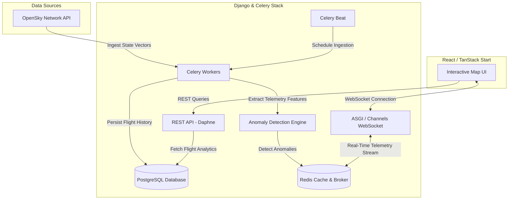

# 🛰️ SkyWatch Live

<div align="center">

**Real-Time Global Airspace Surveillance & Predictive Anomaly Detection Platform**

[](https://github.com/debjit450/skywatch-live/stargazers)
[](https://opensource.org/licenses/MIT)
[](https://react.dev)
[](https://djangoproject.com)
[](https://docs.celeryq.dev)

[⚡ Quick Start](#-quick-start) • [🏗️ Architecture](#-system-architecture) • [🔧 Configuration](#%EF%B8%8F-environment-configuration) • [🚀 Production](#-production-deployment) • [🛡️ Security](#%EF%B8%8F-security-checklist)

---

### ⭐ **Like what you see? [Star this repository](https://github.com/debjit450/skywatch-live) to support open-source aviation intelligence!** ⭐

</div>

---

## 🖥️ Live Dashboard Overview

SkyWatch Live is a state-of-the-art, high-fidelity real-time aircraft tracking and airspace surveillance system. By fusing multi-source telemetry data from the OpenSky Network, regional airspace APIs, and customized machine learning pipelines, SkyWatch Live detects flight path anomalies, stale signals, and trajectory deviations in real-time.


---

## 📊 Live Metrics & Telemetry Analysis

Based on real-world test surveillance sessions, SkyWatch Live is built to scale smoothly under heavy real-time data loads, processing tens of thousands of requests with low latency. Here are the core metrics demonstrated in our live production screenshot:

| Metric Category | Current Live Value | Impact & Capability |
| :--- | :--- | :--- |
| **Simultaneous Aircraft** | **11,862 Live** (10,894 Airborne) | Tracks and updates 11k+ active aircraft vectors globally every 30 seconds with 60fps rendering performance. |
| **Airports Mapped** | **85,390 Airports** (249 Countries) | Full cross-referencing against global airspace coordinates to resolve exact departure, arrival, and elevation data. |
| **Active Anomaly Detection** | **45 Flight Anomalies** (0.38% rate) | Automatic background scanning for stale signals, trajectory drift, and altitude discrepancies via Celery workers. |
| **Telemetry Resolution** | **Sub-second precision** | Renders detailed metrics per flight: exact altitude (e.g. 35,976 ft / FL360), speed (449 kt), heading (326°), and route progress (83.4%). |
| **Data Confidence** | **HIGH Rating** | Intelligent signal verification heuristics filter out noise and validate tracking reliability. |

---

## ✨ Key Features

- 🌐 **Real-Time Stream Processing**: Ingests, normalizes, and streams aircraft states from OpenSky using Django Channels and WebSockets.
- 🧠 **Smart Anomaly & Outlier Engine**: Identifies stale signals, flight path deviations, and abnormal altitudes asynchronously via Celery and built-in ML utility packages.
- 🎨 **Next-Gen Glassmorphic UI**: High-impact dark mode visualization using TanStack Start, React, and Leaflet maps for maximum user immersion.
- 📈 **Granular Filter Controls**: Instantly filter the map by country (e.g. India, USA), callsign, altitude, speed, or anomaly status.
- ⚡ **Dual Architecture Engine**: Run in lightweight `frontend-only` mode (utilizing serverless TanStack Start API routes) or robust `full-stack` mode (using Django, Redis, Celery, and PostgreSQL).

---

## 🏗️ System Architecture

SkyWatch Live operates as an event-driven system built for real-time telemetry streaming and background analytics processing. The dynamic flow diagram below maps out how data is ingested, tracked, analyzed, and broadcast:



---

## 📁 Repository Layout

```text
.
├── 📁 .github/                  # GitHub Actions CI/CD workflows & Dependabot configs
├── 📁 backend/                  # Django backend application, ASGI Channels, and Celery tasks
│   ├── 📁 flights/              # Models, REST API views, WebSockets consumers, and services
│   ├── 📁 ml/                   # Machine learning helpers and telemetry feature extraction
│   ├── 📁 skywatch/             # Settings, ASGI/WSGI entrypoints, and Celery configuration
│   └── 📄 requirements.txt      # Python dependencies list
├── 📁 frontend/                 # React frontend application powered by TanStack Start
│   ├── 📁 src/components/       # High-fidelity dashboard widgets and map UI components
│   ├── 📁 src/hooks/            # React hooks for REST/WS state and tracking logic
│   ├── 📁 src/lib/              # Mathematical models, mapping utilities, and formatters
│   ├── 📁 src/routes/           # Frontend pages, routing, and TanStack server-only endpoints
│   └── 📄 package.json          # Frontend packages and scripts
├── 📁 scripts/                  # Cross-platform environment setup & development utilities
├── 📄 docker-compose.yml        # Multi-container local dependencies orchestration (Postgres, Redis)
├── 📄 package.json              # Root-level shortcuts and build commands
└── 📄 startup.ps1 / startup.bat # Windows development environment bootstrap scripts
```

---

## ⚙️ Runtime Modes

SkyWatch supports two modes of execution depending on your development requirements:

| Runtime Mode | Focus | Operations |
| :--- | :--- | :--- |
| **`frontend-only`** | Lightweight Dev | Runs only the React application. Telemetry feeds are proxied directly through TanStack Start server routes. Excellent for UI and visual customization. |
| **`full-stack`** | Production / Analytics | Launches Django, Redis, Celery, and Postgres. Django ingests live streams, persists tracking history, and runs async ML anomaly checks. **Required for production.** |

---

## 🛠️ Prerequisites

Before launching SkyWatch Live, verify that your development machine has the following tools installed:

- **Node.js** `22.x` or higher (Active LTS) 🟢
- **npm** `10.x` or higher 📦
- **Python** `3.11.x` or higher 🐍
- **Docker Desktop** (or native `PostgreSQL 16+` and `Redis 7+` services) 🐳

---

## ⚡ Quick Start

### 🏁 Automated Setup (Windows)

The simplest way to bootstrap the entire development stack on Windows is using the automated bootstrap script. It configures environment variables, builds backend packages, configures Docker, and applies migrations:

```powershell
npm run startup
npm run dev-all
```

---

### 💻 Manual Step-by-Step Setup

If you prefer to configure the services manually or are running on Linux/macOS, follow the sequence below:

```bash
# 1. Start Postgres and Redis containers
docker compose up -d

# 2. Configure the Django Backend
cd backend
python -m venv venv
source venv/bin/activate  # On Windows, use `.\venv\Scripts\activate`
pip install --upgrade pip
pip install -r requirements.txt
cp .env.example .env
python manage.py migrate
cd ..

# 3. Configure the React Frontend
cd frontend
npm ci
cp .env.example .env.local
cd ..

# 4. Spin up all processes concurrently
npm run dev-all
```

---

### 📍 Local Network Entrypoints

Once running, the application serves endpoints at the following local targets:

- **Surveillance UI Dashboard**: [http://localhost:5173](http://localhost:5173)
- **Django Core REST API**: [http://localhost:8000/api/v1/](http://localhost:8000/api/v1/)
- **Liveness Diagnostics Probe**: [http://localhost:8000/healthz/](http://localhost:8000/healthz/)
- **Readiness Dependency Probe**: [http://localhost:8000/readyz/](http://localhost:8000/readyz/)

---

## 💻 Available Commands

The workspace includes a unified package configuration supporting centralized orchestration. Execute these commands from the repository root:

| Command | Category | Purpose |
| :--- | :--- | :--- |
| `npm run dev` | 🎨 Client | Starts the frontend dev server. |
| `npm run backend-dev` | 🐍 Server | Launches the Django backend development server. |
| `npm run dev-all` | 🚀 Full-Stack | Spins up the React client and Django server concurrently. |
| `npm run check` | 🎨 Client | Verifies React typings, runs lints, and builds the frontend. |
| `npm run backend:check` | 🐍 Server | Performs Django internal validation checks. |
| `npm run backend:check-deploy` | 🐍 Server | Evaluates server settings against production security guidelines. |
| `npm run backend:migrate` | 🐍 Server | Executes pending migrations on the backend database. |
| `npm run backend:test` | 🧪 Quality | Runs the complete Django unit testing suite. |
| `npm test` | 🧪 Quality | Initiates verification suites for both frontend and backend. |

---

## 🔧 Environment Configuration

> [!CAUTION]
> **Credential Security**: Never commit `.env`, `.env.local`, API keys, DB credentials, or generated secrets to source control. The repository ignores these by default.

### 🔒 Backend Environment Configuration (`backend/.env`)

| Variable | Status | Notes & Safe Defaults |
| :--- | :--- | :--- |
| `DJANGO_SECRET_KEY` | 🔴 Required | Cryptographic secret. Rotate this through production secrets managers. |
| `DJANGO_DEBUG` | 🔴 Required | Set to `False` in staging and production to prevent leakage. |
| `ALLOWED_HOSTS` | 🔴 Required | Comma-separated domain list representing your backend addresses. |
| `CSRF_TRUSTED_ORIGINS` | 🔴 Required | Target HTTPS URLs trusted for cross-site requests. |
| `CORS_ALLOWED_ORIGINS` | 🔴 Required | Comma-separated whitelist of frontend domains. |
| `DATABASE_URL` | 🔴 Required | Connection URI for the PostgreSQL server (e.g. `postgresql://...`). |
| `REDIS_URL` | 🔴 Required | Target Redis server URL (essential for Celery & WebSockets). |
| `OPENSKY_CLIENT_ID` | ⚪ Optional | Authenticated username for premium OpenSky API rates. |
| `OPENSKY_CLIENT_SECRET` | ⚪ Optional | OAuth credentials or password fallback for OpenSky. |

### 🎨 Frontend Environment Configuration (`frontend/.env.local`)

| Variable | Status | Notes & Safe Defaults |
| :--- | :--- | :--- |
| `VITE_SKYWATCH_API_BASE` | ⚪ Optional | Base URL of the Django backend (e.g. `https://api.skywatch.live`). |
| `VITE_SKYWATCH_WS_URL` | ⚪ Optional | WebSocket endpoint target (e.g. `wss://api.skywatch.live/ws/flights/`). |
| `OPENSKY_CLIENT_ID` | ⚪ Optional | OpenSky username (accessed strictly inside server routes). |
| `OPENSKY_CLIENT_SECRET`| ⚪ Optional | OpenSky secret (server-side only; never bundled into browser client). |
| `ALLOWED_AIRCRAFT_IMAGE_HOSTS`| ⚪ Optional | Comma-separated list of permitted external domains for planespotting images. |
| `MAX_AIRCRAFT_IMAGE_BYTES` | ⚪ Optional | Safety limitation for image resolution downloads (defaults to `5MB`). |

---

## 🚀 Production Deployment

To ensure the high-fidelity operations seen in telemetry runs, organize the production stack using isolated, scalable services:

### ⚙️ Recommended Process Topography
1. **Frontend Proxy Layer**: Pre-build your React codebase using `npm run build` in `/frontend`, then deploy the output behind a CDN or serve using the TanStack Start Node server.
2. **REST & WebSocket Ingestion Webserver**: Run the Django ASGI layer with a high-performance server (e.g., Daphne or Uvicorn) protected by SSL/TLS terminations.
3. **Task Queue Processor**: Spin up Celery workers:
   ```bash
   celery -A skywatch worker --loglevel=INFO
   ```
4. **Time-Series Scheduler**: Launch Celery beat to manage the state polling:
   ```bash
   celery -A skywatch beat --loglevel=INFO
   ```
5. **Relational Database Layer**: Provision managed `PostgreSQL 16+` with transaction pooling enabled.
6. **In-Memory Transport Layer**: Set up managed `Redis 7+` for caching, Channel Layers, and Celery broker queues.

---

### 🛡️ Pre-Release Audit Script

Run this verification chain locally or inside your CI/CD runner prior to deploying any code version:

```bash
# 1. Run full testing suite
npm test

# 2. Audit backend configuration and check for migration drift
cd backend
python manage.py check --deploy
python manage.py makemigrations --check --dry-run
python manage.py migrate --check
python manage.py collectstatic --noinput --clear
```

> [!TIP]
> **Cloud Probes**: Configure your cloud load balancers or Kubernetes pods to run routine status checks against `/healthz/` (liveness) and `/readyz/` (readiness) to trigger automatic healing.

---

## 🛡️ Security Checklist

- [ ] `DJANGO_DEBUG` must be set to `False` in the production environment.
- [ ] Ensure all database connections are encrypted over SSL.
- [ ] Enforce HTTPS-only routing and configure secure session/CSRF cookies.
- [ ] Keep `CORS_ALLOW_ALL_ORIGINS` disabled (`False`) outside local developers.
- [ ] Limit the image proxy whitelist (`ALLOWED_AIRCRAFT_IMAGE_HOSTS`) to trusted CDN addresses to prevent SSRF vulnerabilities.
- [ ] Configure GitHub Dependabot to automatically check for dependency updates in CI pipelines.

---

## 🔍 Troubleshooting

<details>
<summary><b>❌ Error: <code>DJANGO_SECRET_KEY is required</code></b></summary>
<br>

This indicates that Django cannot find a valid secret key. Copy the `backend/.env.example` template to `backend/.env`, populate `DJANGO_SECRET_KEY` with a strong random string, or execute the rapid bootstrap command:
```powershell
npm run startup
```
</details>

<details>
<summary><b>❌ Error: <code>ALLOWED_HOSTS must be set</code></b></summary>
<br>

When `DJANGO_DEBUG=False`, Django requires explicit host verification to protect against host header injections. Ensure `ALLOWED_HOSTS` in your `backend/.env` lists the public IP or DNS address of your backend web server.
</details>

<details>
<summary><b>❌ Connection Failure: WebSockets or Celery fails with Redis errors</b></summary>
<br>

SkyWatch Channels and queue structures rely heavily on Redis. Ensure your Redis container is running:
```bash
docker compose up -d redis
```
If you are running Redis on a non-standard port or external cloud server, double-check your connection string in `REDIS_URL`.
</details>

<details>
<summary><b>❌ Network Failure: Frontend cannot access Backend REST endpoints</b></summary>
<br>

Confirm that `VITE_SKYWATCH_API_BASE` is pointing to the correct port (usually `http://localhost:8000` when running Django locally) and verify that the backend's `CORS_ALLOWED_ORIGINS` matches the frontend's address exactly.
</details>
