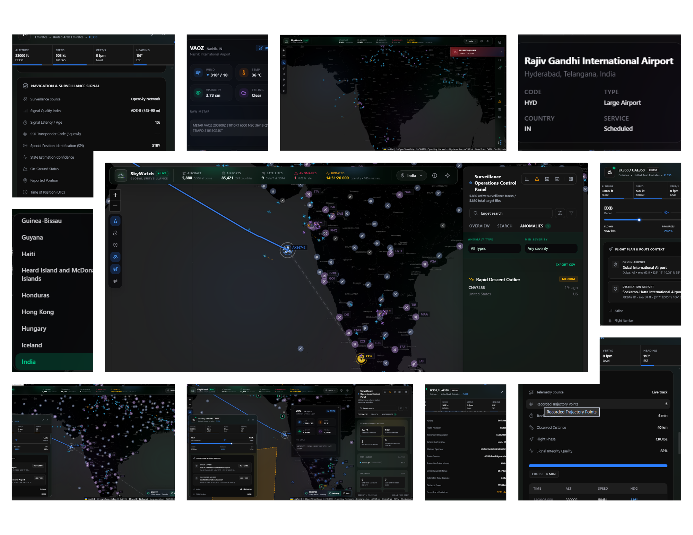
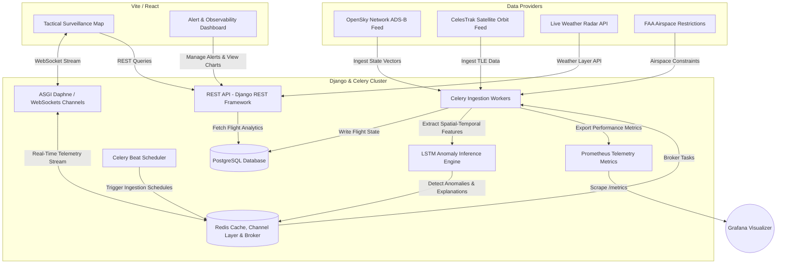

# 🛰️ SkyWatch Live

<div align="center">

**Enterprise Airspace Surveillance, Satellite Propagation & Trajectory Anomaly Detection Platform**

[](https://github.com/debjit450/skywatch-live/stargazers)
[](https://opensource.org/licenses/MIT)
[](https://react.dev)
[](https://djangoproject.com)
[](https://docs.celeryq.dev)

[⚡ Quick Start](#-quick-start) • [🏗️ Architecture](#-system-architecture) • [🔧 Configuration](#%EF%B8%8F-environment-configuration) • [🚀 Production](#-production-deployment) • [🛡️ Security](#-security-checklist) • [📊 Observability](#-observability--telemetry)

</div>

---

## 🖥️ Platform Overview

SkyWatch Live is a high-performance airspace surveillance and flight path telemetry analysis system. The platform integrates real-time telemetry from the OpenSky Network, orbital elements from CelesTrak, and regional airspace constraints to execute predictive trajectory anomaly detection, orbital propagation, and airspace risk assessments. It serves as a tactical decision-support dashboard for operators, utilizing custom machine learning models to identify flight deviations and threat proximity.

<div align="center">
  
</div>

---

## 📊 Live Ingestion & Telemetry Analysis

The following telemetry baseline performance parameters represent the tested ingestion and processing capacities under continuous operational loads:

| Operational Parameter | Baseline Performance | Functional Description & System Impact |
| :--- | :--- | :--- |
| **Monitored Airframes** | **11,862 Active Vectors** (10,894 Airborne) | Ingests and renders high-density global ADS-B telemetry state-vectors on 30-second polling cycles. |
| **Geographic Airport Registry** | **85,390 Mapped Facilities** (249 Countries) | Resolves departure, arrival, elevation coordinates, and distance vectors dynamically on frame selection. |
| **Predictive Anomaly Scans** | **45 Flight Path Anomalies** (0.38% rate) | Asynchronously evaluates trajectories for altitude drift, stale signals, and horizontal deviations via Celery workers. |
| **Satellite Tracking** | **Active Orbital Propagation** | Automatically processes CelesTrak TLE formats and computes satellite footprints on map overlays. |
| **Telemetry Data Granularity** | **Sub-second precision** | Renders precise airframe vectors: Pressure Altitude (FL), groundspeed, heading, and route execution percentage. |
| **Data Verification** | **System Heuristic Filtering** | Filters corrupted telemetry and validates signal confidence before persistence. |

---

## ✨ System Capabilities

### 🛰️ Orbital Mechanics & Space Surveillance
- **TLE Database Integration**: Dynamically ingests Two-Line Element (TLE) datasets from CelesTrak for active satellite constellations.
- **SGP4 Analytical Propagation**: Executes real-time orbital coordinate projection and path tracking via SGP4 mathematical models.
- **Satellite Coverage Mapping**: Calculates and overlays sensor footprints and swaths directly onto the tactical map layout.

### 🛡️ Airspace Constraints & Risk Mitigation
- **Temporary Flight Restrictions (TFR)**: Ingests FAA airspace restriction datasets, mapping dynamic circular hazard sectors and custom exclusion polygons.
- **Conflict Zone Assessment**: Pre-registers high-risk regional airspace coordinates and alerts operators if flight paths intersect with marked geopolitical threat zones.
- **Dynamic Weather Overlays**: Renders live meteorological radar overlays to visualize weather constraints affecting routing decisions.

### 🧠 Trajectory Forecasting & Machine Learning Anomalies
- **LSTM Recurrent Neural Networks**: Uses a spatial-temporal Long Short-Term Memory (LSTM) network to predict planned trajectories and detect non-linear deviations.
- **Multi-Heuristic Anomaly Engine**: Identifies signal dropouts, transponder emergency squawks (7500/7600/7700), altitude threshold violations, and lateral tracking drifts.
- **Explainable AI (XAI) Logging**: Generates programmatic diagnostic logs explaining the physical telemetry parameters that triggered an anomaly flag.

### 📊 System Observability & Tactical Controls
- **Centralized Metrics Hub**: Exposes high-fidelity analytics graphs displaying flight volume distributions, anomaly ratios, and velocity profiles.
- **Custom Rule Configurations**: Allows operators to set custom real-time alert thresholds for vertical speed limits, proximity rules, and coordinate fences.

---

## 🏗️ System Architecture

SkyWatch Live uses an event-driven, microservice-based architecture to handle high-frequency telemetry streaming and asynchronous analytical workloads:



---

## 📁 Repository Layout

```text
skywatch-live/
├── 📁 .github/                  # GitHub Actions CI/CD workflows & Dependabot configs
├── 📁 backend/                  # Django backend application, ASGI Channels, and Celery tasks
│   ├── 📁 flights/              # Models, REST API views, WebSockets consumers, and services
│   │   ├── 📁 management/       # Django commands (e.g. training LSTM models)
│   │   ├── 📁 migrations/       # Database schema versions (observability schema v0006)
│   │   ├── 📁 services/         # Satellite propagation, weather, TFR, and cache APIs
│   │   └── 📄 metrics.py        # Prometheus real-time telemetry metrics exporter
│   ├── 📁 ml/                   # Machine learning helpers, feature engineering, and LSTM layers
│   ├── 📁 skywatch/             # Django settings, ASGI/WSGI entrypoints, and Celery worker configs
│   ├── 📄 manage.py             # Django entrypoint script
│   └── 📄 requirements.txt      # Python dependencies list
├── 📁 frontend/                 # React frontend application powered by Vite & TanStack Start
│   ├── 📁 public/               # Static assets, branding logo, favicons, and UI showcase photos
│   ├── 📁 src/components/       # Ingestion and plotting panels: MapView, AlertRules, Analytics, TopBar
│   ├── 📁 src/hooks/            # React hooks for websocket channels, flights, and satellites
│   ├── 📁 src/lib/              # Orbit mathematics (SGP4), formatters, conflict-zones coordinates
│   ├── 📁 src/routes/           # Page routes, main frame, and TanStack server-only endpoints
│   ├── 📄 vite.config.ts        # Vite build engine configurations
│   └── 📄 package.json          # Frontend packages and scripts
├── 📁 grafana/                  # Grafana provisioning configurations, datasources, and dashboards
├── 📁 monitoring/               # Prometheus target scrape configurations
├── 📁 scripts/                  # Cross-platform environment bootstrap & runner scripts
├── 📄 docker-compose.yml        # Multi-container orchestration (Postgres, Redis, Grafana, Prometheus)
├── 📄 package.json              # Root-level orchestrator shortcuts and build scripts
└── 📄 startup.ps1 / startup.bat # Windows development environment bootstrap scripts
```

---

## ⚙️ Runtime Configurations

The application supports two deployment setups:

| Configuration | Operations | Workflow Description |
| :--- | :--- | :--- |
| **`frontend-only`** | UI Evaluation | Runs only the React application. Feeds are proxied directly using serverless TanStack Start API endpoints. Ideal for quick frontend structure reviews. |
| **`full-stack`** | Production Surveillance | Boots Daphne, Redis, Celery, and Postgres. Enables real-time background ML processing, Grafana dashboards, database persistence, and websocket channels. **Required for production.** |

---

## 🛠️ System Prerequisites

Verify that the local environment matches the following tool standards before deployment:

- **Node.js** `22.x` or higher (Active LTS) 🟢
- **npm** `10.x` or higher 📦
- **Python** `3.11.x` or higher 🐍
- **Docker Desktop** (Or standalone `PostgreSQL 16+`, `Redis 7+`, `Prometheus`, `Grafana`) 🐳

---

## ⚡ Quick Start

### 🏁 Automated Environment Bootstrap (Windows)

To automatically configure local environment variables, build required python packages, execute migrations, configure database containers, and run development servers concurrently:

```powershell
npm run startup
npm run dev-all
```

---

### 💻 Manual Cross-Platform Setup (Linux / macOS)

For manual installations or execution on POSIX-compliant operating systems:

#### 1. Launch Infrastructure Containers
Ensure Docker is active, then spin up Postgres, Redis, Prometheus, and Grafana:
```bash
docker compose up -d
```

#### 2. Configure Backend Server
```bash
cd backend
python -m venv venv
source venv/bin/activate  # On Windows: .\venv\Scripts\activate
pip install -r requirements.txt
cp .env.example .env
python manage.py migrate
python manage.py train_lstm_anomaly  # Execute model weight initialization
cd ..
```

#### 3. Configure Frontend Client
```bash
cd frontend
npm ci
cp .env.example .env.local
cd ..
```

#### 4. Execute Coordinated Process Stack
```bash
npm run dev-all
```

---

### 📍 Local Network Entrypoints

The default local ports and targets are defined as:

- **Surveillance UI Dashboard**: [http://localhost:5173](http://localhost:5173)
- **Django REST API Server**: [http://localhost:8000/api/v1/](http://localhost:8000/api/v1/)
- **Prometheus Metrics Endpoints**: [http://localhost:8000/metrics](http://localhost:8000/metrics)
- **Grafana Observability Portal**: [http://localhost:3000](http://localhost:3000) (Credentials: `admin` / `admin`)
- **Backend Liveness Probe**: [http://localhost:8000/healthz/](http://localhost:8000/healthz/)
- **Backend Readiness Probe**: [http://localhost:8000/readyz/](http://localhost:8000/readyz/)

---

## 💻 Process Management Commands

High-level shortcuts mapped inside the root package orchestrator:

| Command | Process Type | Purpose |
| :--- | :--- | :--- |
| `npm run dev` | Frontend | Boots React development build server. |
| `npm run backend-dev` | Backend | Boots Django backend web server. |
| `npm run dev-all` | Orchestration | Starts React client and Django servers concurrently. |
| `npm run check` | Frontend | Audits React types, runs ESLint checks, and compiles frontend static bundles. |
| `npm run backend:check` | Backend | Performs internal Django syntax and settings integrity validation. |
| `npm run backend:check-deploy` | Backend | Evaluates settings against production security criteria. |
| `npm run backend:migrate` | Backend | Executes structural SQL migrations on the PostgreSQL database. |
| `npm run backend:test` | Quality | Launches backend Django unit test runner. |
| `npm test` | Quality | Executes verification suites across both frontend and backend directories. |

---

## 🔧 Environment Configuration

> [!CAUTION]
> **Credential Security**: Never commit `.env`, `.env.local`, API keys, DB credentials, or generated secrets to source control. The repository ignores these by default.

### 🔒 Backend Configuration Parameters (`backend/.env`)

| Variable | Requirement | Description & Default Settings |
| :--- | :--- | :--- |
| `DJANGO_SECRET_KEY` | 🔴 Required | Core cryptographic key for system signatures and sessions. |
| `DJANGO_DEBUG` | 🔴 Required | Boolean flag. Must be set to `False` in staging and production to prevent disclosure of stack traces. |
| `ALLOWED_HOSTS` | 🔴 Required | Comma-separated list of public hostnames or IP addresses. |
| `CSRF_TRUSTED_ORIGINS` | 🔴 Required | Valid target HTTPS origins allowed to bypass cross-site request forgery protection. |
| `CORS_ALLOWED_ORIGINS` | 🔴 Required | Comma-separated list of approved frontend domain origins. |
| `DATABASE_URL` | 🔴 Required | Complete connection string for target PostgreSQL database. |
| `REDIS_URL` | 🔴 Required | Complete target Redis network endpoint. |
| `OPENSKY_CLIENT_ID` | ⚪ Optional | API client ID to bypass default public request rate limiting. |
| `OPENSKY_CLIENT_SECRET` | ⚪ Optional | API client credential for authenticating with the telemetry feed. |

### 🎨 Frontend Configuration Parameters (`frontend/.env.local`)

| Variable | Requirement | Description & Default Settings |
| :--- | :--- | :--- |
| `VITE_SKYWATCH_API_BASE` | ⚪ Optional | REST endpoint targeting the active backend instance. |
| `VITE_SKYWATCH_WS_URL` | ⚪ Optional | WS protocol endpoint targeting ASGI Channel Layer routing. |
| `OPENSKY_CLIENT_ID` | ⚪ Optional | Ingest client username (restricted to server-side context). |
| `OPENSKY_CLIENT_SECRET`| ⚪ Optional | Ingest client secret (restricted to server-side context; never exposed to browser context). |

---

## 📊 Observability & Telemetry

SkyWatch Live is fully instrumented for standard real-time Prometheus monitoring. 

### Metrics Scraper
The backend exposes a standardized `/metrics` scrape endpoint that aggregates:
1. **System Ingestion Rates**: Flights processed per second, WebSocket active channels, and caching database hit rates.
2. **ML Model Inference Latency**: Computation times of the LSTM recurrent prediction model.
3. **Queue Health**: Task wait-times, active worker counts, and Redis Celery broker state.

### Grafana Dashboards
The `grafana/` directory comes preloaded with provisioning configurations to spin up performance dashboards displaying system liveness, active thread graphs, memory tracking, and error-to-success ingestion ratios.

---

## 🚀 Production Deployment Runbook

For high-availability, continuous airspace surveillance, organize your stack using process isolation:

### ⚙️ Recommended Topography

1. **Static Distribution Layer**: Pre-build your React codebase using `npm run build` in `/frontend`, then serve static assets via high-performance web servers (e.g. Nginx or Cloudflare Edge).
2. **Asynchronous Web Servers**: Daphne or Uvicorn servers should handle dynamic REST API and WebSocket processes within the ASGI layer:
   ```bash
   daphne -b 0.0.0.0 -p 8000 skywatch.asgi:application
   ```
3. **Asynchronous Task Queue**: Deploy Celery workers to process flight predictions, SGP4 orbit computations, and ingestion streams:
   ```bash
   celery -A skywatch worker --loglevel=INFO -Q default,high_priority
   ```
4. **Time-based Task Scheduler**: Launch Celery Beat to trigger routine database cleaning and polling:
   ```bash
   celery -A skywatch beat --loglevel=INFO
   ```
5. **Observability Exporters**: Monitor target system health metrics using the built-in Prometheus and Grafana structures.

---

### 🛡️ Pre-Release Audit Script

Run this verification chain inside your CI/CD runner prior to deploying any production branch:

```bash
# 1. Run complete testing suites and typescript checks
npm test

# 2. Run Django production configuration audits
cd backend
python manage.py check --deploy
python manage.py makemigrations --check --dry-run
python manage.py migrate --check
python manage.py collectstatic --noinput --clear
```

---

## 🛡️ Security Checklist

- [ ] Ensure `DJANGO_DEBUG` is set to `False` in environment variables.
- [ ] Force SSL/TLS database connection routing (`sslmode=require`) on PostgreSQL.
- [ ] Enforce HTTPS-only routing and enable HSTS policies.
- [ ] Keep `CORS_ALLOW_ALL_ORIGINS` disabled (`False`) outside of developer targets.
- [ ] Configure automatic cloud auto-healing using backend `/healthz/` (liveness) and `/readyz/` (readiness) probes.

---

## 🔍 Troubleshooting

<details>
<summary><b>❌ Connection Failure: DJANGO_SECRET_KEY is required</b></summary>
<br>

This indicates that Django cannot find a valid secret key. Copy the `backend/.env.example` template to `backend/.env`, populate `DJANGO_SECRET_KEY` with a strong random string, or execute the rapid bootstrap command:
```powershell
npm run startup
```
</details>

<details>
<summary><b>❌ Connection Failure: ALLOWED_HOSTS must be set</b></summary>
<br>

When `DJANGO_DEBUG=False`, Django requires explicit host verification to protect against host header injections. Ensure `ALLOWED_HOSTS` in your `backend/.env` lists the public IP or DNS address of your backend web server.
</details>

<details>
<summary><b>❌ Connection Failure: WebSockets or Celery fails with Redis errors</b></summary>
<br>

SkyWatch Channels and queue structures rely heavily on Redis. Ensure your Redis container is running:
```bash
docker compose up -d redis
```
If you are running Redis on a non-standard port or external cloud server, double-check your connection string in `REDIS_URL`.
</details>

<details>
<summary><b>❌ Network Failure: Frontend cannot access Backend REST endpoints</b></summary>
<br>

Confirm that `VITE_SKYWATCH_API_BASE` is pointing to the correct port (usually `http://localhost:8000` when running Django locally) and verify that the backend's `CORS_ALLOWED_ORIGINS` matches the frontend's address exactly.
</details>
