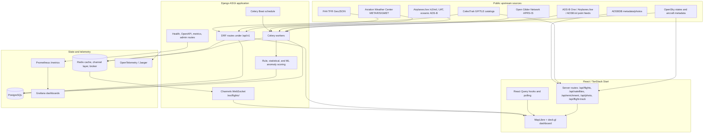
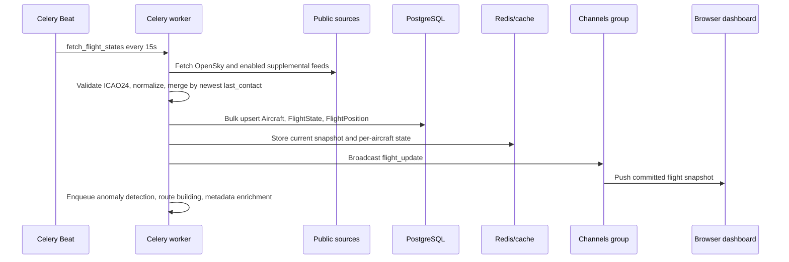

# Architecture Reference

Last reviewed: 2026-05-24.

SkyWatch Live is a hybrid React/TanStack Start and Django architecture. The frontend can run independently against public aviation and satellite APIs, while the full-stack path adds persistent ingestion, anomaly scoring, WebSocket fanout, and observability.

## Runtime Modes

| Mode | Started by | Runtime behavior | Persistence |
| :--- | :--- | :--- | :--- |
| Frontend-only dashboard | `npm run dev` | TanStack Start server routes under `frontend/src/routes/api/` proxy OpenSky, CelesTrak, ADSBDB, and aircraft image requests. The browser renders the MapLibre/deck.gl dashboard and polls local server routes. | None |
| Full-stack local | `npm run dev-all` plus optional Celery worker/beat | React runs on the configured Vite port, Django serves REST and WebSocket APIs on port `8000`, Celery workers ingest and score background data, Redis handles cache/channel/broker duties, and PostgreSQL stores historical state. | PostgreSQL, or SQLite/in-memory fallback only when local debug fallback is enabled |
| Production | Daphne, Celery worker, Celery Beat, reverse proxy, managed PostgreSQL/Redis | Django requires a strong secret, exact hosts/origins, PostgreSQL, Redis, protected metrics, non-default admin path, and secure transport settings. | PostgreSQL with retention/pruning policy |

## System Diagram

## Ingestion Lifecycle

The ingestion contract lives in `backend/flights/tasks.py` and `backend/flights/services/source_adapters.py`.

- OpenSky is fetched first and treated as the required baseline source.
- Supplemental sources are optional and can be disabled with `ADSBONE_ENABLED`, `AIRPLANESLIVE_ENABLED`, `ADSBLOL_ENABLED`, `OGN_ENABLED`, `FAA_RADAR_ENABLED`, `UAT_ENABLED`, and `SATELLITE_ADSB_ENABLED`.
- Records are keyed by normalized lowercase ICAO24. When the same aircraft appears in more than one feed, the freshest `last_contact` record wins while `source_provenance` and recent `source_conflicts` are retained.
- Source confidence is health metadata, not a strict record-selection priority. It is computed from the base source score and current failure/circuit-breaker state.

## API and Transport Surface

| Surface | Code path | Purpose |
| :--- | :--- | :--- |
| `/api/flights` | `frontend/src/routes/api/flights.ts` | Frontend-only OpenSky proxy with stale-position filtering and optional demo payload. |
| `/api/satellites` | `frontend/src/routes/api/satellites.ts` | Frontend-only CelesTrak proxy with SGP4 propagation and bundled bootstrap TLE fallback. |
| `/api/enrichment`, `/api/photo`, `/api/flight-track` | `frontend/src/routes/api/` | ADSBDB metadata/photo proxy and OpenSky track helpers. |
| `/api/v1/flights/` and related routes | `backend/flights/urls.py` | Full-stack Django REST API for flights, routes, predictions, anomalies, analytics, weather, airspace, sources, and satellites. |
| `/ws/flights/` | `backend/flights/routing.py`, `backend/flights/consumers.py` | Channels stream for initial snapshots, committed `flight_update` events, and `anomaly_alert` messages. |
| `/healthz/`, `/readyz/`, `/health/live`, `/health/ready`, `/health/metrics` | `backend/skywatch/urls.py` | Liveness, readiness, and JSON operational probes. |
| `/metrics` | `backend/skywatch/urls.py` | Prometheus scrape endpoint, protected by Basic Auth when metrics credentials are configured. |
| `/api/schema/`, `/api/docs/` | `backend/skywatch/urls.py` | OpenAPI schema and Swagger UI when `drf-spectacular` is available. |

## Data Model Responsibilities

| Model | Role |
| :--- | :--- |
| `Aircraft` | Latest known identity, source, registration, owner, and counters for each ICAO24. |
| `FlightState` | Time-series state snapshots used by map data, analytics, route building, and ML features. |
| `FlightPosition` | Append-only historical position stream for playback and route reconstruction. |
| `FlightRoute` | Sessionized route paths built from recent state history. |
| `AnomalyEvent` | Persisted rule, statistical, ML, ensemble, and custom-rule anomaly events with explainability and feedback fields. |
| `AlertRule` | User-authored threshold and geofence rules evaluated by Celery. |
| `IngestionSourceHealth` / `IngestionAudit` | Current source status and append-only fetch audit trail. |
| `MLModelVersion` / `AircraftProfile` | Model governance and per-aircraft behavioral baselines. |

## Scheduled Work

Celery Beat currently schedules these recurring jobs from `backend/skywatch/settings.py`:

| Schedule | Task |
| :--- | :--- |
| 15 seconds | `flights.tasks.fetch_flight_states` |
| 30 seconds | `flights.tasks.update_flight_predictions` |
| 30 seconds | `flights.tasks.evaluate_custom_alert_rules` |
| 5 minutes | `flights.tasks.refresh_tfr_cache` |
| 5 minutes | `flights.tasks.synthetic_health_check` |
| 1 hour | `flights.tasks.cleanup_old_data` |
| 1 day | `flights.tasks.retrain_model` |
| 1 week | `flights.tasks.retrain_lstm_model` |

`fetch_flight_states` also enqueues anomaly detection, route building, and aircraft metadata enrichment after database commit.

## Observability and Scaling

- Redis is the cache, Channels layer, Celery broker, and Celery result backend when configured.
- Local debug mode may fall back to SQLite and in-memory cache/channel layers. Production blocks that fallback.
- Docker Compose provisions PostgreSQL, PgBouncer, Redis, Jaeger, Prometheus, and Grafana. It does not currently run the backend or frontend application containers.
- Horizontal WebSocket scaling requires all Daphne/ASGI instances to share the same Redis Channels layer.
- Long-running deployments should rely on the hourly cleanup task and evaluate database partitioning for high-volume `FlightState` and `FlightPosition` tables.
