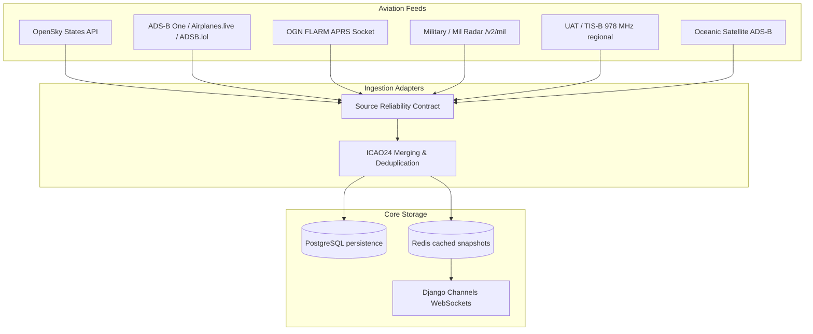
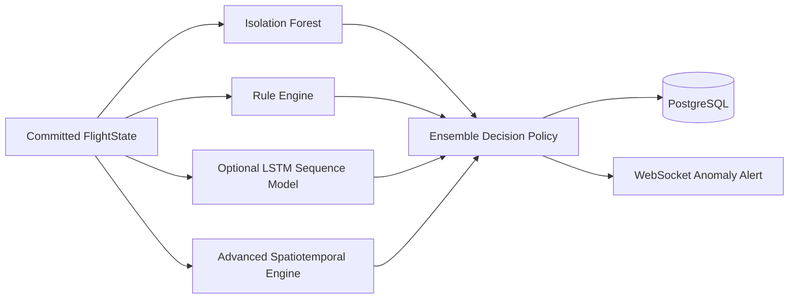

# Architecture Reference

SkyWatch Live features a hybrid React-Django architecture engineered for extreme resilience under erratic public API availability. It supports two decoupled operational pathways:

- **Frontend-only (Serverless Dashboard):** TanStack Start server-side routing serves as an API proxy. It makes raw public requests to OpenSky and CelesTrak, performs in-memory SGP4 propagation, and feeds the Leaflet mapping client without database dependencies.
- **Full-stack (Continuous Surveillance):** A multi-tenant Django/Celery environment that persistently ingests, normalizes, dedupes, scores, caches, and broadcasts aerospace vectors globally.

---

## 1. Data Ingestion & Normalization Flow

1. **Celery Beat Execution:** Schedules the standard `fetch_flight_states` task every 15 seconds.
2. **Contract Validation:** Ingestion adapters fetch concurrent streams. Each stream is checked against a *Source Reliability Contract* which records response latencies, active/normalized/rejected records, consecutive failures, and automatically triggers local circuit breakers (opening on 3 consecutive HTTP/timeout errors).
3. **Merging & Deduplication:** Feeds are merged into a unified aircraft record. If the same `icao24` address appears across multiple sources, they are prioritized based on source confidence coefficients (`opensky` at 0.96, down to `satellite` at 0.74). The source is appended as provenance metadata, and telemetry registers deduplication conflicts.
4. **Committed State Persistence:** Bulk inserts are written in a single transaction to PostgreSQL to record `FlightState` (latest flight status metrics) and `FlightPosition` (historical trajectory coordinate lines).
5. **Caching & WebSocket Broadcast:** Snapshots are serialized and stored in Redis, immediately triggering a Daphne WebSocket broadcast (`flight_update` event) to all active `/ws/flights/` clients.

---

## 2. Anomaly Detection & Scoring Pipeline

Once ingestion commits, Celery triggers `run_anomaly_detection` to evaluate flight vectors using an ensemble pipeline:

- **Rule Engine:** Immediate kinematic scans check for Emergency squawks (7500, 7600, 7700), rapid ascents/descents, unusual supersonic profiles, and transponder signal timeouts.
- **Isolation Forest (ML):** Evaluates a 30-dimensional normalized feature vector extracted via `backend/ml/features.py`. The model evaluates category speed/altitude envelopes and labels outliers.
- **LSTM Sequence Autoencoder (Optional):** If TensorFlow is installed, a sliding history of the last 30 states (`lstm.py`) is propagated to estimate trajectory reconstruction error.
- **Advanced Spatiotemporal Engine:** Analyzes circling/loitering (heading changes > 720°), holding patterns (3+ heading reversals), and flight profile z-score deviations. Proximity alerts are evaluated horizontally (<5 NM) and vertically (<1000 ft) relative to all airborne neighbors.
- **Explainability Payload:** Anomaly alerts compile an explanation payload mapping feature deviations, which is pushed to active operators via WebSockets (`anomaly_alert` event).

---

## 3. Storage & Partitioning Policy

`FlightState` and `FlightPosition` grow exponentially. The default stack supports standard PostgreSQL but production environments must evaluate partitioning:
* **TimescaleDB:** For treating `FlightPosition` as a hyper-table partitioned by 1-day intervals.
* **PostGIS:** To replace Python Haversine algorithms with database-level R-Trees and spatial indexed geofencing.
* **Data Retention:** The included `prune_flight_data` command is designed to trim position logs older than 7 days, maintaining a stable storage envelope.

---

## 4. Observability Architecture

- **Prometheus Metrics:** The `/metrics` route exposes request latencies, active flight counts, active WS connections, and anomaly severities, protected by Basic Auth in production.
- **Jaeger Tracing:** Request telemetry and task durations are exported using standard OpenTelemetry OTLP channels (`http://localhost:4317`).
- **Grafana Dashboards:** Provisioned dashboards read Prometheus metrics to track ingestion staleness, memory consumption, task lag, and channel performance in real-time.
